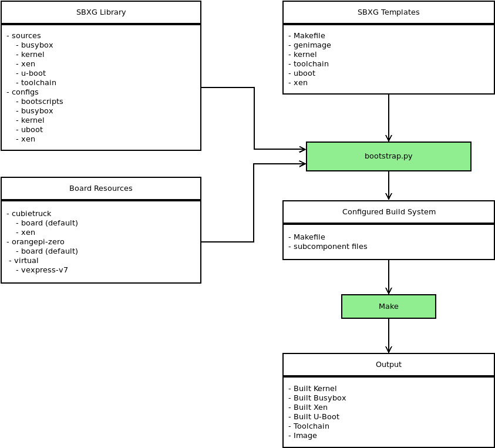

Starting Up with SBXG
=====================

SBXG will retrieve and build bootloaders and kernels (e.g. U-Boot, Linux, Xen),
but does not create nor configure a root file system! This task is up to you,
or dedicated tools that you chose to use. However, SBXG proposes a "toy" script
that creates a minimal Debian root file system from scratch so you can use SBXG,
even when you don't have a root file system.

SBXG proposes various built-in configurations. In function whether these offer
support for Xen or not, different root file systems may be needed. This
document proposes the command-line sequences to be paired with the default
options proposed by SBXG. They all assume a POSIX shell is being used (e.g.
bash), and are initiated from the top source directory of SBXG.

Cubietruck Default
-------------------

.. code::

   mkdir build && cd build
   ../scripts/create-debootstrap.sh
   ../bootstrap.py --board cubietruck --toolchain armv7-eabihf
   make

Cubietruck with Xen (1 guest)
-----------------------------

.. code::

   mkdir build && cd build
   sudo ../scripts/create-debootstrap.sh -x
   sudo ../scripts/create-debootstrap.sh -o guest0_rootfs.ext3
   ../bootstrap.py --board cubietruck --board-variant xen --toolchain armv7-eabihf
   make

